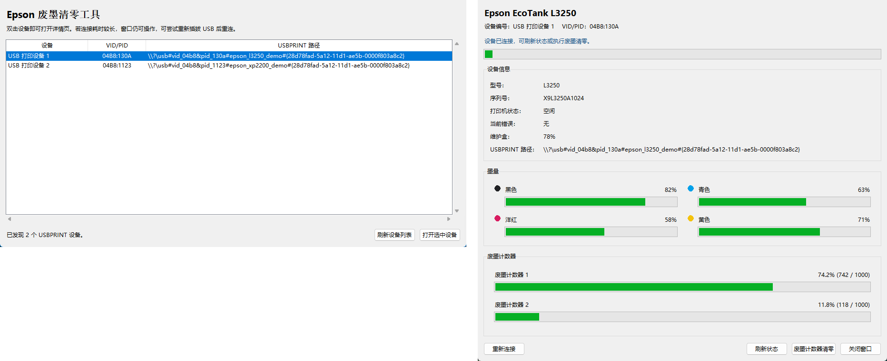

# ez-reset



Reset waste ink counters on Epson printers via USB on Windows.

## 中文说明

`ez-reset` 是一个面向 Windows 的 Epson 废墨计数器工具，使用 USB 直接与打印机通信。

- 支持查看墨量和废墨计数器状态
- 支持重置废墨计数器
- 适合无法通过网络/SNMP 方案处理的新型号 Epson 打印机
- 现在的 GUI 已改为后台连接和后台读取状态，设备响应慢时窗口不会再直接“未响应”

### 安装

```powershell
python -m pip install .
```

开发模式安装：

```powershell
python -m pip install -e .
```

### 启动

```powershell
python -m ez_reset
```

### 使用建议

- 双击主窗口里的 USBPRINT 设备即可打开详情页
- 如果连接或刷新耗时较长，界面会保持可操作状态
- 如果打印机或 USBPRINT 通道卡住，重新插拔 USB 后点击“重新连接”通常可以恢复
- 若出现异常，程序会在当前目录写入 `ez-reset.log`

**Want to help with development, learn more about Epson printers, or simply need help?** Join the Discord server for a new community I want to try starting called "NoSPE - No Stupid Printer Errors": https://discord.gg/fspDRHNrU3

## What it does

- Shows ink levels and waste ink counter status
- Resets waste ink counters
- Works with many Epson printer models over USB
- Compatibility with newer Epson models/firmware (ET-2850, ET-2860, L3250, L3260, L18050, XP-2200, XP-7100, etc.) where the addition of the `SNMP_SECURITY_ACCESS_ENABLE` flag in their firmware prevents access to NVRAM factory commands over SNMP (making those models incompatible with [Ircama/epson_print_conf](https://github.com/Ircama/epson_print_conf))

<details>

<summary>Compatible printer models</summary>

ez-reset has definitions for (and thus *theoretically* supports) the following printers. However, compatibility with the vast majority of models is untested.

- Epson Stylus Color 760
- Epson Stylus Color 860
- Epson Stylus Color 1150
- Epson Stylus Color 1160
- Epson Stylus Photo 820U
- Epson Stylus Photo 830U
- Epson Stylus Photo 785
- Epson Stylus Photo 825
- Epson Stylus Photo 890
- Epson Stylus Photo 895
- Epson Stylus Photo 900
- Epson Stylus Photo 915
- Epson Stylus Photo 925
- Epson Stylus Photo 935
- Epson Stylus Photo 950
- Epson Stylus Photo 960
- Epson Stylus Photo 1280
- Epson Stylus Photo 1290
- Epson Stylus Photo 2100
- Epson Stylus Photo 2200
- Epson Stylus Photo 1390
- Epson Stylus Photo 1400
- Epson Stylus Photo 1410
- Epson PM-3500C
- Epson PM-3700C
- Epson PM-4000PX
- Epson PM-G4500
- Epson PF-70
- Epson PF-71
- Epson PF-81
- Epson Picture Mate
- Epson Picture Mate 100
- Epson Picture Mate 200
- Epson Picture Mate 210
- Epson Picture Mate 215
- Epson Picture Mate 225
- Epson Picture Mate 235
- Epson Picture Mate 240
- Epson Picture Mate 245
- Epson Picture Mate 250
- Epson Picture Mate 260
- Epson Picture Mate 270
- Epson Picture Mate 280
- Epson Picture Mate 290
- Epson Picture Mate 300
- Epson Picture Mate 310
- Epson Picture Mate 400
- Epson E-300
- Epson E-330
- Epson E-340
- Epson E-350
- Epson E-360
- Epson E-500
- Epson E-520
- Epson E-600
- Epson E-700
- Epson E-720
- Epson E-800
- Epson Stylus C41
- Epson Stylus C42
- Epson Stylus C43
- Epson Stylus C44
- Epson Stylus C45
- Epson Stylus C46
- Epson Stylus C47
- Epson Stylus C48
- Epson Stylus C58
- Epson Stylus C59
- Epson Stylus C60
- Epson Stylus C61
- Epson Stylus C62
- Epson Stylus C70
- Epson Stylus C77
- Epson Stylus C78
- Epson Stylus C79
- Epson Stylus C80
- Epson Stylus C82
- Epson Stylus C90
- Epson Stylus C91
- Epson Stylus C92
- Epson Stylus D78
- Epson Stylus D92
- Epson Stylus C110
- Epson Stylus C120
- Epson Stylus D120
- Epson PX-V700
- Epson PX-V780
- Epson Stylus CX2800
- Epson Stylus CX2900
- Epson Stylus CX3100
- Epson Stylus CX3200
- Epson Stylus CX3300
- Epson Stylus CX3400
- Epson Stylus CX3700
- Epson Stylus CX3800
- Epson Stylus CX3900
- Epson Stylus CX4000
- Epson Stylus CX4100
- Epson Stylus CX4200
- Epson Stylus CX4700
- Epson Stylus CX4800
- Epson Stylus CX4900
- Epson Stylus CX5000
- Epson Stylus CX5900
- Epson Stylus CX6000
- Epson Stylus CX7300
- Epson Stylus CX7400
- Epson Stylus CX7700
- Epson Stylus CX7800
- Epson Stylus CX8300
- Epson Stylus CX8400
- Epson Stylus CX9300F
- Epson Stylus CX9400F
- Epson Stylus DX3800/DX3850
- Epson Stylus DX4000/DX4050
- Epson Stylus DX4200/DX4250
- Epson Stylus DX4800/DX4850
- Epson Stylus DX5000/DX5050
- Epson Stylus DX6000/DX6050
- Epson Stylus DX7400/DX7450
- Epson Stylus DX8400/DX8450
- Epson Stylus DX9400/DX9450
- Epson Stylus CX4300
- Epson Stylus CX4400
- Epson Stylus CX4450
- Epson Stylus CX5500
- Epson Stylus DX4400
- Epson Stylus CX5600
- Epson Stylus DX4450
- Epson Stylus R240/R245
- Epson Stylus R250
- Epson Stylus R260
- Epson Stylus R265
- Epson Stylus R270
- Epson Stylus R280
- Epson Stylus R285
- Epson Stylus R290/R295
- Epson Stylus R330
- Epson Stylus R340
- Epson Stylus R350
- Epson Stylus R360
- Epson Stylus R380
- Epson Stylus R390
- Epson Stylus R800
- Epson PM-G800
- Epson PM-G820
- Epson PM-G850
- Epson PM-G860
- Epson PM-D800
- Epson PM-D870
- Epson Stylus R1800
- Epson Stylus R1900
- Epson Stylus R2400
- Epson Stylus R2880
- Epson Stylus R2000
- Epson Stylus R3000
- Epson PX-G5000
- Epson PX-G5100
- Epson PX-G5300
- Epson PX-7V
- Epson PX-5V
- Epson Stylus RX520
- Epson Stylus RX530
- Epson Stylus RX560/RX565
- Epson Stylus RX580
- Epson Stylus RX585
- Epson Stylus RX590
- Epson Stylus RX595
- Epson Stylus RX610/RX615
- Epson Stylus RX640
- Epson Stylus RX650
- Epson Stylus RX680
- Epson Stylus RX685
- Epson Stylus RX690
- Epson Stylus RX700
- Epson PM-A820
- Epson PM-A840
- Epson PM-A840S
- Epson PM-A890
- Epson PM-A900
- Epson PM-A940
- Epson PM-A920
- Epson PM-A950
- Epson PM-A970
- Epson PM-T960
- Epson PM-T990
- Epson B300
- Epson B308
- Epson B310N
- Epson B500DN
- Epson B508DN
- Epson B510DN
- Epson Stylus T10
- Epson Stylus T11
- Epson Stylus T20
- Epson Stylus T23
- Epson Stylus T26
- Epson Stylus S20
- Epson Stylus T21
- Epson Stylus T24
- Epson Stylus T27
- Epson Stylus S21
- Epson Stylus T30
- Epson Stylus T33
- Epson Stylus B30
- Epson Stylus T40W
- Epson Stylus B40W
- Epson ME Office 70
- Epson ME Office 80
- Epson WorkForce 30
- Epson WorkForce 40
- Epson WorkForce 60
- Epson PX-101
- Epson PX-201
- Epson PX-203
- Epson ME Office 82WD
- Epson ME Office 85ND
- Epson Stylus T42WD
- Epson Stylus B42WD
- Epson Stylus P50
- Epson Stylus T50/T59
- Epson Stylus T60
- Epson Artisan 50
- Epson Stylus T1100
- Epson Stylus T1110
- Epson Stylus B1100
- Epson ME Office 1100
- Epson WorkForce 1100
- Epson PX-1001
- Epson Stylus Photo 1430
- Epson Stylus Photo 1500W
- Epson Artisan 1430
- Epson EP-4004
- Epson Stylus TX200/TX205/TX209
- Epson Stylus SX200/SX205/SX209
- Epson Stylus NX200/NX205/NX209
- Epson Stylus TX210/TX215/TX219
- Epson Stylus SX210/SX215/SX219
- Epson Stylus NX210/NX215/NX219
- Epson Stylus TX220
- Epson Stylus SX218
- Epson Stylus NX220
- Epson Stylus SX230
- Epson Stylus TX235
- Epson Stylus SX235W
- Epson Stylus TX230
- Epson Stylus NX230
- Epson Stylus TX235W
- Epson Stylus TX300F
- Epson Stylus BX300F
- Epson Stylus NX300
- Epson Stylus TX320F
- Epson Stylus BX305FW
- Epson Stylus BX305FW+
- Epson Stylus TX325F
- Epson Stylus TX400/TX405/TX409
- Epson Stylus SX400/SX405/SX409
- Epson Stylus NX400/NX405/NX409
- Epson Stylus TX410/TX415/TX419
- Epson Stylus SX410/SX415/SX419
- Epson Stylus NX410/NX415/NX419
- Epson Stylus TX420W
- Epson Stylus SX420W
- Epson Stylus NX420
- Epson Stylus SX425W
- Epson Stylus TX430W
- Epson Stylus SX430W
- Epson Stylus NX330
- Epson Stylus TX435W
- Epson Stylus SX440W
- Epson Stylus NX430
- Epson Stylus SX435W
- Epson Stylus TX510FN
- Epson Stylus TX515FN
- Epson Stylus BX310FN
- Epson Stylus TX525FW
- Epson Stylus BX320FW
- Epson Stylus SX535WD
- Epson Stylus BX535WD
- Epson Stylus NX530
- Epson Stylus NX635
- Epson Stylus TX550
- Epson Stylus SX510/SX515
- Epson Stylus NX510/NX515
- Epson Stylus TX560WD
- Epson Stylus SX525WD
- Epson Stylus BX525WD
- Epson Stylus NX620/NX625
- Epson Stylus TX600FW
- Epson Stylus SX600FW
- Epson Stylus BX600FW
- Epson Stylus TX610FW
- Epson Stylus SX610FW
- Epson Stylus BX610FW
- Epson Stylus TX620FWD
- Epson Stylus SX620FW
- Epson Stylus BX620FWD
- Epson Stylus BX625FWD
- Epson Stylus BX630FW
- Epson Stylus BX635FWD
- Epson Stylus TX650/TX659
- Epson Stylus PX650/PX659
- Epson Stylus PX660
- Epson Stylus TX700W
- Epson Stylus PX700W
- Epson Stylus TX710W
- Epson Stylus PX710W
- Epson Stylus TX720WD
- Epson Stylus PX720WD
- Epson Stylus TX730WD
- Epson Stylus PX730WD
- Epson Stylus TX800FW
- Epson Stylus PX800FW
- Epson Stylus TX810FW
- Epson Stylus PX810FW
- Epson Stylus TX820FWD
- Epson Stylus PX820FWD
- Epson Stylus TX830FWD
- Epson Stylus PX830FWD
- Epson Stylus BX925FWD
- Epson Stylus BX935FWD
- Epson ME Office 510
- Epson ME Office 520
- Epson ME Office 530
- Epson ME Office 560
- Epson ME Office 570
- Epson ME Office 620
- Epson ME Office 650
- Epson ME Office 900
- Epson ME Office 940
- Epson ME Office 960
- Epson ME Office 600
- Epson ME Office 700
- Epson WorkForce 310
- Epson WorkForce 320/325
- Epson WorkForce 435
- Epson WorkForce 500
- Epson WorkForce 520/525
- Epson WorkForce 545
- Epson WorkForce 600
- Epson WorkForce 610/615
- Epson WorkForce 620/625
- Epson WorkForce 630/635
- Epson WorkForce 645
- Epson WorkForce 840
- Epson WorkForce 845
- Epson Artisan 725
- Epson Artisan 835
- Epson Artisan 630
- Epson Artisan 700
- Epson Artisan 710
- Epson Artisan 720
- Epson Artisan 730
- Epson Artisan 800
- Epson Artisan 810
- Epson Artisan 830
- Epson Artisan 837
- Epson XP-30/33
- Epson XP-55
- Epson XP-100
- Epson XP-102/103
- Epson XP-200
- Epson XP-205/207
- Epson XP-201/204/208
- Epson XP-202/203/206
- Epson XP-210
- Epson XP-215/217
- Epson XP-211/214/216
- Epson XP-212/213
- Epson XP-220/221
- Epson XP-225
- Epson XP-230/231
- Epson XP-235
- Epson XP-240/241/242
- Epson XP-243/245/247
- Epson XP-300/301
- Epson XP-302/303/305/306
- Epson XP-310/311
- Epson XP-312/313/315/316
- Epson XP-320/324
- Epson XP-322/323/325
- Epson XP-330/334
- Epson XP-332/333/335
- Epson XP-340/344
- Epson XP-342/343/345
- Epson XP-400/401
- Epson XP-402/403/405/406
- Epson XP-410/411
- Epson XP-412/413/415/416
- Epson XP-420/421/424
- Epson XP-422/423/425
- Epson XP-430/431/434
- Epson XP-432/433/435
- Epson XP-440/441/446
- Epson XP-442/443/445
- Epson XP-255/257
- Epson XP-352/355
- Epson XP-452/455
- Epson XP-510
- Epson XP-520
- Epson XP-530
- Epson XP-540
- Epson XP-600/601/605
- Epson XP-610/611/615
- Epson XP-620/621/625
- Epson XP-630/631/635
- Epson XP-640/641/645
- Epson XP-700/701/702
- Epson XP-800/801/802
- Epson XP-710
- Epson XP-810
- Epson XP-720/721
- Epson XP-820/821
- Epson XP-750
- Epson XP-850
- Epson XP-830
- Epson XP-760
- Epson XP-860
- Epson XP-900
- Epson XP-950
- Epson XP-960
- Epson XP-970
- Epson XP-2100/2101/2105
- Epson XP-2150/2151/2155
- Epson XP-2200/2201/2205
- Epson XP-3100/3101/3105
- Epson XP-3150/3151/3155
- Epson XP-3200/3200/3200
- Epson XP-4100/4101/4105
- Epson XP-4150/4151/4155
- Epson XP-4200/4201/4205
- Epson XP-5100/5101/5105
- Epson XP-5150/5151/5155
- Epson XP-5200/5201/5205
- Epson XP-6000/6005/6006
- Epson XP-6100/6105/6106
- Epson XP-7100/7105/7106
- Epson XP-8500/8505/8506
- Epson XP-8600/8605/8606
- Epson XP-8700/8705/8706
- Epson XP-15000/15080
- Epson WP-4010
- Epson WP-4011
- Epson WP-4015
- Epson WP-4020
- Epson WP-4022
- Epson WP-4023
- Epson WP-4025
- Epson WP-4090
- Epson WP-4091
- Epson WP-4092
- Epson WP-4095
- Epson WP-4511
- Epson WP-4515
- Epson WP-4520
- Epson WP-4521
- Epson WP-4525
- Epson WP-4530
- Epson WP-4531
- Epson WP-4532
- Epson WP-4533
- Epson WP-4535
- Epson WP-4540
- Epson WP-4545
- Epson WP-4590
- Epson WP-4592
- Epson WP-4595
- Epson WP-M4011
- Epson WP-M4015
- Epson WP-M4095
- Epson WP-M4521
- Epson WP-M4525
- Epson WP-M4595
- Epson WF-2010/2011/2018
- Epson WF-2010/2011/2018
- Epson WF-2510/2511/2518
- Epson WF-2520/2521/2528
- Epson WF-2530/2531/2538
- Epson WF-2540/2541/2548
- Epson WF-2630/2631/2635
- Epson WF-2650/2651/2655
- Epson WF-2660/2661/2665
- Epson WF-2750/2751/2755
- Epson WF-2760/2761/2765
- Epson WF-2810/2811/2815
- Epson WF-2820/2821/2825
- Epson WF-2830/2831/2835
- Epson WF-2840/2841/2845
- Epson WF-2910/2911/2915
- Epson WF-2930/2931/2935
- Epson WF-2950/2951/2955
- Epson WF-2850/2851/2855
- Epson WF-2860/2861/2865
- Epson WF-2870/2871/2875
- Epson WF-2880/2881/2885
- Epson WF-2960/2961/2965
- Epson WF-3010/3011/3012
- Epson WF-3510/3511/3512
- Epson WF-3520/3521/3522
- Epson WF-3530/3531/3532
- Epson WF-3540/3541/3542
- Epson WF-3620/3621/3622
- Epson WF-3640/3641/3642
- Epson WF-3720/3723/3725
- Epson WF-3730/3733/3735
- Epson WF-4630/WF-4636
- Epson WF-4640/WF-4646
- Epson WF-4720/4723/4724/4725
- Epson WF-4730/4733/4734/4735
- Epson WF-4740/4743/4744/4745
- Epson WF-3820/3823/3824/3825
- Epson WF-4820/4823/4824/4825
- Epson WF-4830/4833/4834/4835
- Epson WF-5110/5111/5113
- Epson WF-5190/5191/5193
- Epson WF-5620/5621/5623
- Epson WF-5690/5691/5693
- Epson WF-C4310
- Epson WF-C4810
- Epson WF-C5210
- Epson WF-C5310
- Epson WF-C5290
- Epson WF-C5390
- Epson WF-C5290BA
- Epson WF-C5390BA
- Epson WF-C5290BAM
- Epson WF-C5390BAM
- Epson WF-C5710
- Epson WF-C5790
- Epson WF-C5810
- Epson WF-C5890
- Epson WF-C5290BA
- Epson WF-C5790BA
- Epson WF-C5890BAM
- Epson WF-C8610
- Epson WF-6090/6091/6093
- Epson WF-6530/6531/6533
- Epson WF-6590/6591/6593
- Epson WF-7010
- Epson WF-7011
- Epson WF-7012
- Epson WF-7015
- Epson WF-7018
- Epson WF-7110/7111/7115
- Epson WF-7210/7211/7215
- Epson WF-7310/7311/7315
- Epson WF-7510
- Epson WF-7511
- Epson WF-7515
- Epson WF-7520
- Epson WF-7521
- Epson WF-7525
- Epson WF-7610
- Epson WF-7611
- Epson WF-7615
- Epson WF-7620
- Epson WF-7621
- Epson WF-7625
- Epson WF-7710
- Epson WF-7715
- Epson WF-7720
- Epson WF-7725
- Epson WF-7820/7825/7828
- Epson WF-7830/7835/7838
- Epson WF-7840/7845/7848
- Epson WF-8010
- Epson WF-8090
- Epson WF-8093
- Epson WF-8510
- Epson WF-8590
- Epson WF-8593
- Epson WF-R4640
- Epson WF-R5190
- Epson WF-R5690
- Epson WF-M1030
- Epson WF-M1138
- Epson WF-M1560
- Epson WF-M5190/WF-M5198/WF-M5199
- Epson WF-M5690/WF-M5698/WF-M5699
- Epson WF-M5290
- Epson WF-M5298
- Epson WF-M5299
- Epson WF-M5799
- Epson WF-M5299BAM
- Epson WF-M5799BAM
- Epson K100
- Epson K101
- Epson K105
- Epson K200
- Epson K201
- Epson K205
- Epson K300
- Epson K301
- Epson K305
- Epson L800
- Epson L805
- Epson L810
- Epson L850
- Epson L110/L111
- Epson L210/L211
- Epson L120
- Epson L130
- Epson L132
- Epson L220
- Epson L222
- Epson L300/L301/L303/L308
- Epson L350/L351/L353/L358
- Epson L310
- Epson L312
- Epson L355
- Epson L360
- Epson L362
- Epson L364
- Epson L365
- Epson L366
- Epson L375
- Epson L380
- Epson L382
- Epson L385
- Epson L386
- Epson L395
- Epson L396
- Epson L405
- Epson L455
- Epson L456
- Epson L475
- Epson L485
- Epson L486
- Epson L495
- Epson L550/L551/L552/L553/L554
- Epson L555/L556/L557/L558/L559
- Epson L565
- Epson L566
- Epson L575
- Epson L605/L606
- Epson L655/L656
- Epson L1110
- Epson L1118
- Epson L1119
- Epson L1210/L1216/L1218/L1219
- Epson L1230/L1236/L1238/L1239
- Epson L1250/L1256/L1258/L1259
- Epson L1270/L1276/L1278/L1279
- Epson L3200/L3201/L3203/L3205
- Epson L3206/L3207/L3208/L3209
- Epson L3210/L3211/L3213/L3215
- Epson L3216/L3217/L3218/L3219
- Epson L3230/L3231/L3233/L3235
- Epson L3236/L3237/L3238/L3239
- Epson L3250/L3251/L3253/L3255
- Epson L3256/L3257/L3258/L3259
- Epson L3260/L3261/L3263/L3265
- Epson L3266/L3267/L3268/L3269
- Epson L3270/L3271/L3273/L3275
- Epson L3276/L3277/L3278/L3279
- Epson L3280/L3281/L3283/L3285
- Epson L3286/L3287/L3288/L3289
- Epson L4260/L4261/L4263/L4265
- Epson L4266/L4267/L4268/L4269
- Epson L6260/L6266/L6268/L6269
- Epson L6270/L6276/L6278/L6279
- Epson L6290/L6296/L6298/L6299
- Epson L6460/L6466/L6468/L6469
- Epson L6490/L6496/L6498/L6499
- Epson L1300
- Epson L1455
- Epson L1800
- Epson L3050
- Epson L3060
- Epson L3070
- Epson L3550/L3556/L3558
- Epson L5590/L5596/L5598
- Epson L3100/L3101
- Epson L3104/L3105
- Epson L3106/L3107
- Epson L3108/L3109
- Epson L3110/L3111
- Epson L3114/L3115
- Epson L3116/L3117
- Epson L3118/L3119
- Epson L3150/L3151
- Epson L3152/L3153
- Epson L3156/L3158
- Epson L3160/L3166/L3168
- Epson L3161/L3163/L3165
- Epson L4150/L4152/L4154/L4156/L4158
- Epson L4151/L4153/L4155/L4157/L4159
- Epson L4160/L4162/L4164/L4166/L4168
- Epson L4161/L4163/L4165/L4167/L4169
- Epson L5190/L5196/L5198
- Epson L5290/L5296/L5298
- Epson L5310/L5316/L5318
- Epson L6160/L6161/L6166/L6168
- Epson L6170/L6171/L6176/L6178
- Epson L6190/L6191/L6196/L6198
- Epson L6550/L6551/L6558
- Epson L6570/L6571/L6578
- Epson L6580/L6581/L6588
- Epson L8050/L8058
- Epson L7160/L7168
- Epson L7180/L7188
- Epson L8160/L8168
- Epson L8180/L8188
- Epson L11160/L11168
- Epson L14150/L14158
- Epson L15150/L15158
- Epson L15160/L15168
- Epson L15180/L15188
- Epson L11050/L11058
- Epson L18050/L18058
- Epson M1100
- Epson M1120
- Epson M2110/M2118/M2119
- Epson M2120/M2128/M2129
- Epson M1140
- Epson M1170
- Epson M1180
- Epson M2140
- Epson M2170
- Epson M2180
- Epson M3140
- Epson M3170
- Epson M3180
- Epson ET-M1140
- Epson ET-M1170
- Epson ET-M1180
- Epson ET-M2140
- Epson ET-M2170
- Epson ET-M2180
- Epson ET-M3140
- Epson ET-M3170
- Epson ET-M3180
- Epson M15140/M15146/M15147/M15148
- Epson M15180/M15186/M15187/M15188
- Epson ET-M16600
- Epson ET-M16680
- Epson ET-1110/1111/1113/1115
- Epson ET-1112/1114/1116/1118
- Epson ET-1810/1811/1813/1815
- Epson ET-1812/1814/1816/1818
- Epson ET-2700/2701/2703/2705
- Epson ET-2702/2704/2706/2708
- Epson ET-2710/2711/2713/2715
- Epson ET-2712/2714/2716/2718
- Epson ET-2720/2721/2723/2725
- Epson ET-2722/2724/2726/2728
- Epson ET-2400/2401/2403/2405
- Epson ET-2402/2404/2406/2408
- Epson ET-2800/2801/2803/2805
- Epson ET-2802/2804/2806/2808
- Epson ET-2810/2811/2813/2815
- Epson ET-2812/2814/2816/2818
- Epson ET-2820/2821/2823/2825
- Epson ET-2822/2824/2826/2828
- Epson ET-2830/2831/2833/2835
- Epson ET-2832/2834/2836/2838
- Epson ET-2850/2851/2853/2855
- Epson ET-2860/2861/2863/2865
- Epson ET-2870/2871/2873/2875
- Epson ET-2500
- Epson ET-2550
- Epson ET-2600
- Epson ET-2610
- Epson ET-2650
- Epson ET-2750/2751/2756
- Epson ET-2760/2761/2766
- Epson ET-3600
- Epson ET-3700
- Epson ET-3710
- Epson ET-3750
- Epson ET-3760
- Epson ET-3800
- Epson ET-3830
- Epson ET-4500
- Epson ET-4550
- Epson ET-4700
- Epson ET-4750
- Epson ET-4760
- Epson ET-4800
- Epson ET-4810
- Epson ET-5150
- Epson ET-5170
- Epson ET-5800
- Epson ET-5850
- Epson ET-5880
- Epson ET-7700
- Epson ET-7750
- Epson ET-8500
- Epson ET-8550
- Epson ET-8700
- Epson ET-3850/3856/3850U
- Epson ET-4850/4856/4850U
- Epson ET-14000
- Epson ET-15000
- Epson ET-16150
- Epson ET-16500
- Epson ET-16600
- Epson ET-16650
- Epson ET-16680
- Epson ET-18100
- Epson ET-M1100/ET-M1108/ET-M1109
- Epson ET-M1120/ET-M1128/ET-M1129
- Epson ET-M2120/ET-M2128/ET-M2129
- Epson EP-M570T
- Epson EW-M571T
- Epson EW-M530F
- Epson EW-M630T
- Epson EW-M634T
- Epson EW-M770T
- Epson EW-M873T
- Epson EW-M660FT
- Epson EW-M670FT
- Epson EW-M674FT
- Epson EW-M5071FT
- Epson EW-M5610FT
- Epson EW-M970A3T
- Epson EW-M973A3T
- Epson Workforce ST-2000
- Epson Workforce ST-3000
- Epson Workforce ST-4000
- Epson Workforce ST-5000
- Epson Workforce ST-7000
- Epson Workforce ST-C2100
- Epson Workforce ST-C4100
- Epson Workforce ST-C8000
- Epson Workforce ST-C8090
- Epson M100
- Epson M105
- Epson M200
- Epson M205
- Epson ME-200
- Epson ME-10
- Epson ME-85
- Epson ME-100/ME-101
- Epson ME-300/ME-301
- Epson ME-302/ME-303
- Epson ME-400/ME-401
- Epson EC-4020
- Epson EC-4030
- Epson EC-4040
- Epson EC-C7000
- Epson EP-301
- Epson EP-302
- Epson EP-306
- Epson EP-702A
- Epson EP-703A
- Epson EP-704A
- Epson EP-705A
- Epson EP-706A
- Epson EP-707A
- Epson EP-708A
- Epson EP-709A
- Epson EP-775A
- Epson EP-776A
- Epson EP-777A
- Epson EP-801A
- Epson EP-802A
- Epson EP-803A
- Epson EP-804A
- Epson EP-805A
- Epson EP-806A
- Epson EP-807A
- Epson EP-808A
- Epson EP-810A
- Epson EP-879A
- Epson EP-880A
- Epson EP-884A
- Epson EP-901A
- Epson EP-901F
- Epson EP-902A
- Epson EP-902F
- Epson EP-903A
- Epson EP-903F
- Epson EP-904A
- Epson EP-904F
- Epson EP-905A
- Epson EP-905F
- Epson EP-907A
- Epson EP-906A
- Epson EP-906F
- Epson EP-907F
- Epson EP-976A3
- Epson EP-977A3
- Epson EP-978A3
- Epson EP-979A3
- Epson EP-982A3
- Epson EP-10VA
- Epson EP-30VA
- Epson PX-404A
- Epson PX-434A
- Epson PX-501A
- Epson PX-502A
- Epson PX-503A
- Epson PX-504A
- Epson PX-601F
- Epson PX-602F
- Epson PX-603F
- Epson PX-673F
- Epson PX-045A
- Epson PX-046A
- Epson PX-047A
- Epson PX-048A
- Epson PX-049A
- Epson PX-435A
- Epson PX-436A
- Epson PX-437A
- Epson PX-105
- Epson PX-205
- Epson PX-405A
- Epson PX-505F
- Epson PX-535F
- Epson PX-605F
- Epson PX-675F
- Epson PX-1200
- Epson PX-1600F
- Epson PX-1700F
- Epson PX-204
- Epson PX-1004
- Epson PX-5500
- Epson PX-5600
- Epson PX-A640
- Epson PX-A720
- Epson PX-A740
- Epson PX-K100
- Epson PX-K150
- Epson PX-K701
- Epson PX-K751F
- Epson PX-S380
- Epson PX-S381L
- Epson PX-B700
- Epson PX-B750F
- Epson PX-M160T
- Epson PX-S160T
- Epson PX-S170T
- Epson PX-S170UT
- Epson PX-S5040
- Epson PX-S5080
- Epson PX-M380F
- Epson PX-M381FL
- Epson PX-M650A
- Epson PX-M650F
- Epson PX-M680F
- Epson PX-M740F
- Epson PX-M741F
- Epson PX-M780F
- Epson PX-M781F
- Epson PX-M791FT
- Epson PX-M840F
- Epson PX-M860F
- Epson PX-M884F
- Epson PX-S730
- Epson PX-S840
- Epson PX-S884
- Epson PX-FA700
- Epson PX-M5040F
- Epson PX-M5041F
- Epson PX-M6010F
- Epson PX-M6011F
- Epson PX-S7050
- Epson PX-M7050
- Epson PX-M5080F
- Epson PX-M5081F
- Epson PX-S6710T
- Epson PX-S7050PS
- Epson PX-M7050FP
- Epson PX-M6711FT
- Epson PX-M6712FT
- Epson EW-052A
- Epson EW-452A
- Epson EW-456A
- Epson SC-P400
- Epson SC-P407
- Epson SC-P408
- Epson SC-P600
- Epson SC-P607
- Epson SC-P608
- Epson SC-P800
- Epson SC-P700
- Epson SC-P708
- Epson SC-P900
- Epson SC-P908
- Epson SC-PX7VII
- Epson SC-PX5VII
- Epson SC-PX3V
- Epson SC-PX1V
- Epson SC-PX1VL
- Epson WF-100
- Epson PX-S05
- Epson WF-110
- Epson EC-C110
- Epson PX-S06
- Epson PP-50
- Epson PP-100

</details>

## Requirements

- Windows
- Supported Epson printer connected via USB

## Installation (easy)

Grab a prebuilt binary from the *Releases* tab or [download directly from here](https://github.com/CiRIP/ez-reset/releases/latest/download/ez-reset.exe).

## Installation (advanced)

If you wish to experiment with the code, or otherwise distrust the prebuilt .exe, you can install the package on your
system:

```bash
pip install .
```

## Usage (advanced)

Run the GUI:

```bash
python -m ez_reset
```

1. The app will list detected USB printers
2. Double-click a printer to open its control panel
3. View ink levels and waste counter status
4. Click "Reset All" to reset waste counters
5. Restart your printer after resetting

## Warning

This tool modifies printer firmware counters. Use at your own risk. Always restart the printer after resetting waste counters.

## See also

- [Ircama/epson_print_conf](https://github.com/Ircama/epson_print_conf)
- [abrasive/epson-reversing](https://github.com/abrasive/epson-reversing)
